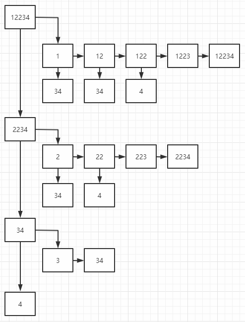

一、将数组排序，如[2,1,2,4,3]得排成[1,2,2,3,4]

二、不能出现重复子集，那么如何做到呢？以下给出本题求子集的方法：

    1.最初没有元素被选择，或者说选中的元素为[]，把此刻被选中的元素当成子集加入答案中(包括[]);

    2.首先确定求子集的层数，或者说要求解的集合数，
      其中每一集合都有特定的元素(去重复)
      比如上面这个例子，可以确定有4个集合，
      分别为[1,2,2,3,4],[2,2,3,4],[3,4],[4],每层特有元素分别为1，2，3，4;

    3.在每一层中选元素，每一次调用choose,就是选中一个元素，
      这一层中的每个元素都可被选或不被选(即允许求出来的子集有[1,2,2]这样)，
      最重要的是每当有一个元素被选中，就得把被选中的元素都加进ans结果中;

    4.按顺序不断选中每个元素同时加入结果，然后在回溯时，再去掉一个选中的元素，
      然后选择被删除元素的后面那些元素为子集合，再以该集合重复2步骤。

三、具体例子推导过程(可以这样理解)

第零层(特殊)：[], 剩余的子集为[1,2,2,3,4],故开启新的一层

第一层(特殊元素为1)：
先向下深搜，有[1],[1,2],[1,2,2],[1,2,2,3],[1,2,2,3,4]

        现在开始回溯并去除元素4([1,2,2,3]),但4后面没有元素了，故继续回溯

        现在开始回溯并去除元素3([1,2,2]),然后3后面有子集合[4]，
        再对[4]进行分层，有一层且该层只有4，故有[1,2,2,4]

        现在开始回溯并去除元素2([1,2])，然后2后面有子集合[3,4]
        再对[3,4]进行分层，第一层为[3],[3,4],第二层为[4]，故有[1,2,3],[1,2,3,4],[1,2,4]

        现在开始回溯并去除元素2([1]),然后2后面有集合[2,3,4]，但因为求子集合不能有重复元素，
        故子集合为[3，4]，故有[1,3],[1,3,4],[1,4]

        现在开始回溯并去除元素1([]),然后有子集合[2,2,3,4]，开启新的一层

第二层(特殊元素为2):
先向下深搜，有[2],[2,2],[2,2,3],[2,2,3,4]

        现在开始回溯并去除元素4([2,2,3]),但4后面没有元素了，故继续回溯
        
        现在开始回溯并去除元素3([2,2]),然后3后面有子集合[4]，
        再对[4]进行分层，有一层且该层只有4，故有[2,2,4]

        现在开始回溯并去除元素2([2])，然后2后面有子集合[3,4]
        再对[3,4]进行分层，第一层为[3],[3,4],第二层为[4]，故有[2,3],[2,3,4],[2,4]

        现在开始回溯并去除元素2([]),然后2后面有子集合[2,3,4]，
        但是2重复了，故子集合为[3,4],开启新的一层

后面也是以此类推
结果：
[],
[1],[1,2],[1,2,2],[1,2,2,3],[1,2,2,3,4],[1,2,2,4],[1,2,3],[1,2,3,4],[1,2,4],[1,3],[1,3,4],[1,4],
[2],  [2,2],  [2,2,3],  [2,2,3,4],  [2,2,4],  [2,3],  [2,3,4],  [2,4],
[3],  [3,4],
[4]
